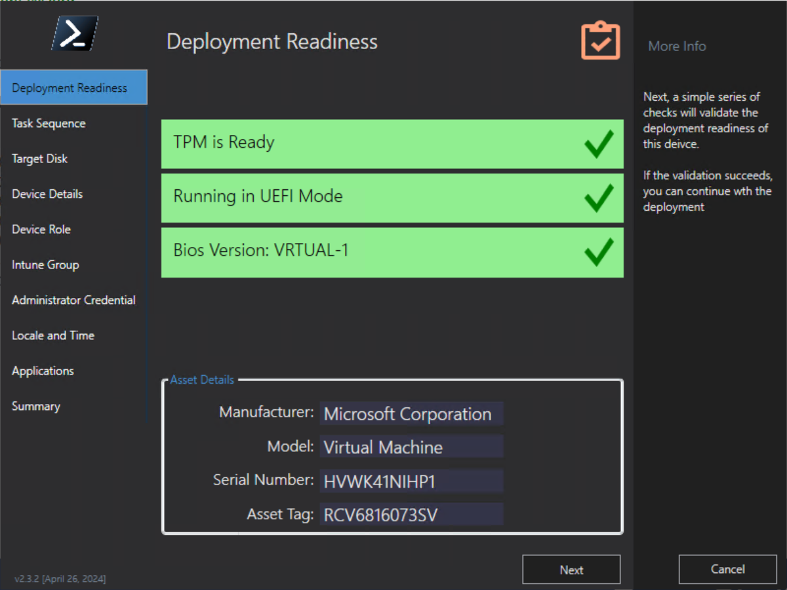
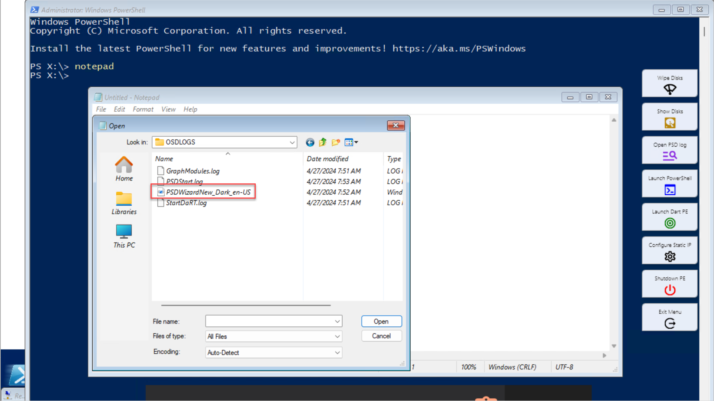
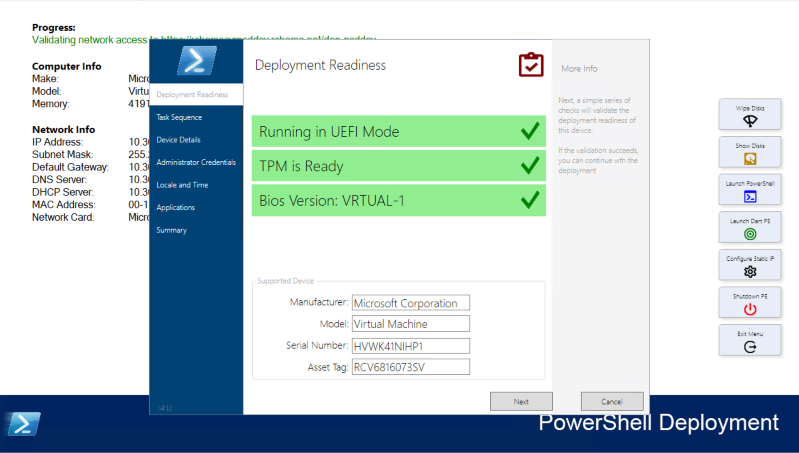
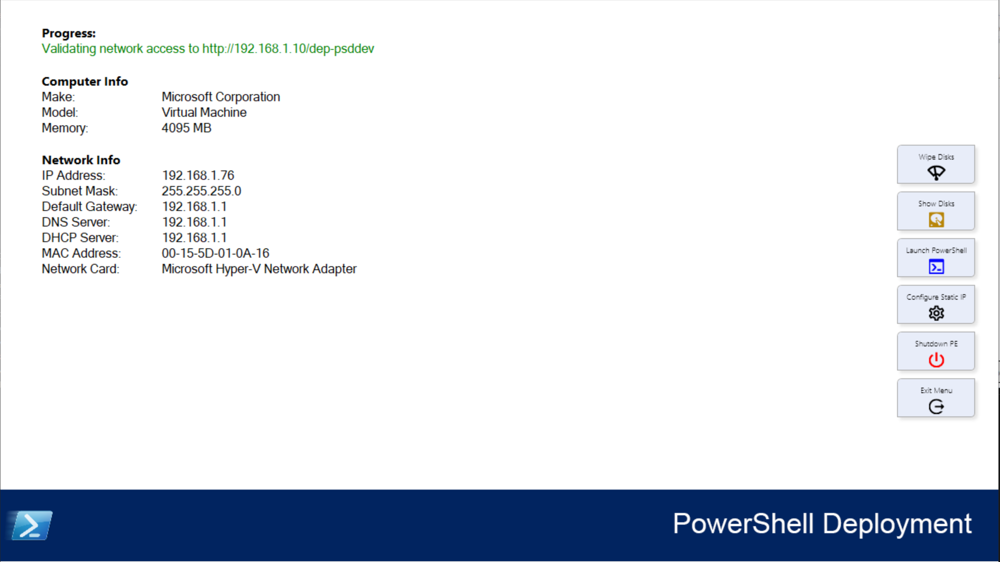

# New PSD Wizard Guide

One of the latest features in PSD is the wizard, which closely resembles the classic MDT interface, with a few additional themes available.

## About the wizard

The new wizard is developed using the XAML language, supporting the Windows Presentation Format (WPF), instead of the previous HTA (HTML) format. You can learn more about XAML here.: [XAML Overview](https://learn.microsoft.com/en-us/windows/uwp/xaml-platform/xaml-overview).

## Themes

This new wizard includes two primary themes, both reminiscent of the MDT interface. Themes can be changed via the CustomSettings.ini.

- Native --> Original theme for PSD (Set _PSDWizard=**Native**_ or leave blank)


- Classic --> Default theme. Looks and feels like MDT original menu (Set _PSDWizard=**PSDWizardNew**_ and _PSDWizardTheme=**Classic**_)


- Dark --> Looks and feels like MDT original menu but dark theme (Set _PSDWizard=**PSDWizardNew**_ and _PSDWizardTheme=**Dark**_)


> Addtional themes can be found [here](https://github.com/PowerShellCrack/PSDWizardNew_CustomThemes)
## The underlying structure

The wizard's structure is designed to be modular and includes controllable features similar to the original MDT wizard. While it uses the same XML definitions as the original, there are additional XML files for themes, languages, and pages. For more details, see the structure section.

```
DeploymentShare
    |-Tools
        |-Modules
            |-PSDWizardNew
                |--PSDWizardNew.psm1
    |-Scripts
        |--PSDListOfLanguages.xml
        |--PSDListOfTimeZoneIndex.xml
        |-PSDWizardNew
            |--PSDWizard.Initialize.ps1
            |--PSDWizard.Definition_<Language>.xml
            |-Resources
                |--<icons,colors,buttons,etc > in XAML format
            |-Themes
                |--Classic_Theme_Definitions_<Language>.xml
                |--Dark_Theme_Definitions_<Language>.xml
                |-Classic
                    |--Classic-<paneid>-<Language>.xaml
                |-Dark
                    |--Dark-<paneid>-<Language>.xaml

```

> Currently, only **en-US** is supported, but there is potential for additional languages in the future.

## File explanations

- **PSDWizardNew.psm1**: This module is loaded to present the UI. Each page is divided into its respective XAML file. The module references the customsettings.ini for any skips, language, and theme variables, compares these with the definition files (e.g., PSDWizard.Definition_**en-US**.xml and **Classic**\_Theme_Definitions_**en-US**.xml), and then constructs all pages into a single UI.
- **PSDWizard.Initialize.ps1**: This script no longer contains PSDWizard functions (it is not part of the module) but can be used to support additional functions during the wizard process.
- **PSDListOfLanguages.xml**: Used in the UI to display the locale dropdown.
- **PSDListOfTimeZoneIndex.xml**: Used in the UI to display the time zone dropdown.
- **\<Resource\>.xaml files**: These contain the variant theme buttons, icons, and visual dependencies for the UI.
- **\<Theme\>_Theme_Definitions_\<Language\>.xml**: Contains a list of pages (_aka Panes_) each theme can use and their IDs.
- **\<theme\>-\<paneid\>-\<Language\>.xaml**: Contains each page for each theme. For example, in the classic theme, there is a _PSDWizard_Applications_en-US.xaml_ file that defines the layout of the applications page in English.

## Supported variables in _Bootstrap.ini_

- **SkipBDDWelcome**: YES or NO. Toggles the Welcome splash screen.

## Supported variables in _CustomSetting.ini_

- **OSDComputerName**: Even though this is a standard MDT variable, the PSD wizard supports some dynamic values:
  - **_%SERIALNUMBER%_**: Replaced with the device's serial number.
  - **_%SERIAL%_**: Replaced with the device's serial number.
  - **_%SERIAL:\<NUM\>%_**: Replaced with the last **num**bers of the serial number (e.g., %SERIAL:7%).
  - **_%\<NUM\>:SERIAL%_**: Replaced with the first **num**bers of the serial number (e.g., %7:SERIAL%).
  - **_%RAND:\<NUM\>%_**: Replaced with an alphanumeric character of **num**bers (e.g., %RAND:7%).

> NOTE: **AssetTag** property is not supported currently

Here are skip properties that can be set:

- **SkipBDDWelcome**: YES or NO. Toggles the Welcome splash screen.
- **SkipTaskSequence**: YES or NO. Toggles the Task sequence page.
- **SkipDomainMembership**: YES or NO. Toggles the Computer name section in the device details page.
- **SkipComputerName**: YES or NO. Toggles the Computer name section in the device details page.
- **DeploymentType**: ONLY SUPPORTS NEWDEPLOYMENT.
- **SkipAdminPassword**: YES or NO. Toggles the admin password section on the admin page.
- **SkipLocaleSelection**: YES or NO. Toggles the Language section on the locale page.
- **SkipTimeZone**: YES or NO. Toggles the Time Zone section on the locale page.
- **SkipApplications**: YES or NO. Toggles the Application page (see known issue).
- **SkipSummary**: YES or NO. Toggles the summary page (shows what was selected in the UI).

> IMPORTANT: In the latest release of PSD, the PSD variable definitions are now included without declaring them in the properties section

The added PSDwizard properties are as follows:

- **PSDWizard**: Native or PSDWizardNew. Native is the original wizard (not new).
- **PSDWizardTheme**: Classic, Dark (see theme section for details and screenshots). For more theme go here: [PSDWizardNew_CustomThemes](https://github.com/PowerShellCrack/PSDWizardNew_CustomThemes)
- **PSDWizardLogo**: Adds a logo to the top left corner of the wizard and the Welcome page (e.g., PSDWizardLogo=%SCRIPTROOT%\powershell.png).
- **SkipPSDWelcome**: YES or NO. Toggles the Welcome splash screen.
- **SkipDeployReadiness**: YES or NO. Toggles the deployment readiness page.
- **SkipReadinessCheck**: YES or NO. Skips any readiness checks. This option is ignored if SkipDeployReadiness is NO, and the readiness check will not run.
- **SkipPSDWizardSplashScreen**: YES or NO. Toggles the splash screen before launching the wizard. If ZeroTouch deployment is performed, be sure to disable this too. 
- **PSDReadinessAllowBypass**: YES or NO. Allows the PSD Wizard to continue even if the readiness check returns false.
- **PSDReadinessScript**: Place PowerShell script in %DEPLOYROOT%\PSDResources\Readiness folder.
- **PSDReadinessCheck001**: Invokes command or function from the readiness script.
- **PSDReadinessCheck002**: Invokes command or function from the readiness script.
- **PSDReadinessCheck003**: Invokes command or function from the readiness script.
- **PSDReadinessCheck004**: Invokes command or function from the readiness script.
- **PSDWizardCustomPaneAllowBypass**: YES or NO. If custom pages are added to the wizard and no script is found, the next button will be disabled. This will override that.
- **PSDWizardCollapseTSList**: YES or NO. Collapses the Task Sequences folder list. By default, they are all expanded. This can be handy when there are a lot of folders.

Other supported properties

- **DomainOUs**: List. If more than one is found, the UI will toggle a drop down for the selction instead an input box. Start with DomainOUs001 and use full distinguish name. 

EXAMPLE: 
```ini
DomainOUs001=OU=Workstations,OU=MYOU,DC=MYDOMAIN,DC=LOCAL
DomainOUs002=OU=Servers,OU=MYOU,DC=MYDOMAIN,DC=LOCAL
```

>NOTE: If `MachineObjectOU` is populated with one of the listed values in DomainOUs list, the wizard will preselect that one but provide the dropdown incase it needs to change

- **PSDReadinessCheck**: List. These are the functions called in the readiness page. See [Readiness Additional requirements](#readiness-additional-requirements) for detailed usage.
- **PSDDebug**: YES or NO. Activates Debug Mode, and the constructed UI will be exported with logs.


## Readiness Additional requirements

The Deployment readiness page can be configured to run a readiness script against the device. The readiness checks have two requirements:

- It must be in PowerShell function form.
- It must return an object with two properties:
  - **Message**: 'Message to display' (keep the message short for UI display; recommended 60 characters or less).
  - **Ready**: True|False.

There can be as many functions as needed; however, only four can be invoked during the PSDWizard Deployment Readiness pane.

An example of a readiness function could look like:

```powershell
Function Test-IsUEFI{
    #create an object with two properties
    $Obj = "" | Select Ready,Message
    Try{
        $Null = Get-SecureBootUEFI -Name SetupMode -ErrorAction Stop
        $Obj.Message = "Running in UEFI Mode"
        $Obj.Ready = $True
    }Catch{
        $Obj.Message = "Not in UEFI Mode"
        $Obj.Ready = $False
    }
    Return $Obj
}
```

The output would look like this:


## Keyboard shortcuts

- **Escape** : will make the menu not be on top (allows other screens to go in front)
- **Space bar** : will close the PSD Welcome Wizard (if enabled)
- **Tab** : will navigate menu forward
- **Shift Tab** : will navigate menu reverse
- **F5**: will refresh Task sequence list
- **F9**: minimizes the wizard
- **F11**: activates a debug window of PSDWizard (this is still in testing). 
> **WARNING**: if windows is closed it will close the PSDWizard as well
- **Arrows**: Controls location of prestart menu if shows. Default to right

# Custom Pages

It is possible to add or remove pages in the PSD Wizard. Since a UDI wizard is not available yet, this process must be done manually and may require some experience with XAML.

> ATTENTION: detailed instructions and sample pages are here: https://github.com/PowerShellCrack/PSDWizardNew_CustomPages

## NEW FEATURES

In addition to the new wizard, there is another module released:

- PSDStartLoader

The PSDStartLoader is a UI driven prestart menu (replaces the CLI prestart menu). This module can be activated within the bootstrap.ini

- **PSDPrestartMode** --> _Native_,_PrestartMenu_, or _FullScreen_. The Prestartmenu launches a menu within the boot sequence that provides other menus such as diskinfo, diskwipe, and static ip configuration. It can also detect if DART and CMtrace is installed in PE and will display a button for each

> **IMPORTANT**: The _FullScreen_ option is still in BETA; it replaces the bginfo background with a UI backdrop (that will eventually monitor the TaskSequence in a modern fashion potentially replacing the task sequence progress bar). It to will present the prestart menu as well. _Native_ puts it back to CLI version.

While the menu is loaded; you can use the keyboard's arrow keys to control the position of the menu. It defaults to the right side of screen. To preset the position, set the variable **PSDPrestartPosition** with one of these values: _VerticalLeft_, _VerticalRight_, _HorizontalTop_, _HorizontalBottom_

The menu does have some hidden features as well:

- **CMTrace support**: if the menu finds cmtrace within WinPE's system32 folder, it will add an additional button for to launch PSDlogs with cmtrace.
- **DaRT support**: if dart is added to WinPE, the menu will add an additional button to launch the menu. 




# CHANGELOG

The changelog can be found here: [CHANGELOG.MD](../Scripts/PSDWizardNew/CHANGELOG.md)

## Known issues

 - Applications will not install even if selected in UI, This is because the code is nulled if no applications are listed in CustomSettings.ini. The workaround is to set a real or dummy application in CustomSettings.ini. 
 
 Example:

 ```ini
 APPLICATIONS001={d7f2f50a-e85f-425e-a2f7-68392b1f31a6}
 ```
